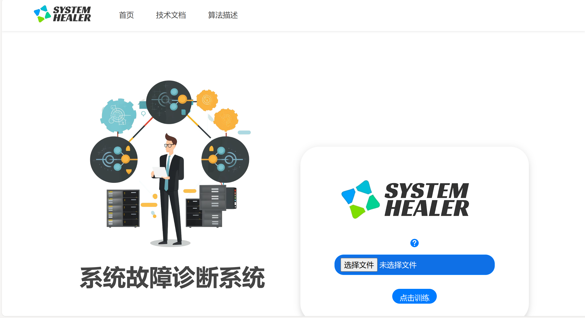

<div align = "center">
    <image src = "./pics/logo.jpg" width = "50%"/>
	<h1 align = "center">基于机器学习的分布式系统故障诊断系统</h1>    
    <h4 align = "center">系统治愈师团队 | System Healer Team</h4>
</div>
## 一、信息介绍

大数据时代，分布式系统成为信息存储和处理的主流系统。相对于传统系统而言，分布式系统更为庞大和复杂，故障发生的平均几率比较高，其运维的难度和复杂度大大提高。如何对分布式系统进行高效、准确的运维，成为保障信息系统高效、可靠运行的关键问题。
为此，我们团队设计了故障诊断模型，可以高效地分析并识别故障类别，实现分布式系统故障运维的智能化，快速恢复故障的同时大大降低分布式系统运维工作的难度，减少运维对人力资源的消耗。

在分布式系统中某个节点发生故障时，故障会沿着分布式系统的拓扑结构进行传播，造成自身节点及其邻接节点相关的KPI指标和发生大量日志异常。中兴通讯为我们提供分布式数据库的故障特征数据和标签数据，其中特征数据是系统发生故障时的KPI指标数据，KPI指标包括由feature0、feature1 ...feature106共107个指标，标签数据为故障类别数据，共6个类别，用0、1、2、3、4、5分别表示6个故障，根据这些数据，我们借助机器学习、深度学习、web等技术搭建故障诊断系统，该系统支持用户上传训练集对模型进行训练和模型下载，同时支持用户上传单条或多条测试语句进行测试并可视化测试结果，同支持测试结果与模型的下载。

---

模型采用`django + bootstrap`为框架进行web系统的开发，模型采用`Resnet18`。

---

下面是我们团队的分工：

| 团队成员 | 分工                                               | 备注 |
| -------- | -------------------------------------------------- | ---- |
| 张骁凯   | 负责django web框架的搭建，测试即Web服务器的部署    | 队长 |
| 杨尚君   | 负责数据预处理部的编写、测试，前端页面的设计与实现 | 队员 |
| 李思成   | 负责深度学习模型的搭建，测试，参数调整和数据可视化 | 队员 |

## 二、Web系统介绍

### 2.1 概述




### 2.2 部署方法

####  2.2.1 使用脚本进行部署

在`SystemHealer/`目录运行`setup.sh`脚本，可以一键构建环境，安装有关依赖，并打开默认浏览器预览网页。

如果系统没有打开浏览器，可以在构建完成之后手动输入<127.0.0.1:8000>或者<localhost:8000>来访问web系统。

#### 2.2.2 使用 Docker 进行部署

在`SystemHealer/`目录运行以下命令来构建 Docker 镜像：
```bash
docker build -t systemhealer .
```

构建完成后，运行以下命令来启动 Docker 容器：

```bash
docker run -p 8000:8000 systemhealer
```

现在，您可以在浏览器中输入<127.0.0.1:8000>或 `localhost:8000` 来访我们的Web系统。

## 三、模型介绍

在本项目中，我们采用了深度学习中的一种重要模型——ResNet18，作为我们的基础模型进行分类任务。ResNet，全称深度残差网络（Deep Residual Network），是由何凯明等人于2015年提出的一种深度学习模型。其主要创新在于引入了残差连接（Residual Connection），这一设计有效地解决了深度卷积神经网络中的梯度消失（Vanishing Gradient）问题，使得网络可以更深入地学习数据的复杂特征，并在各种任务上取得优越的性能。

ResNet-18是一种深度残差网络（ResNet）的变体，由Kaiming He等人在2015年的论文"Deep Residual Learning for Image Recognition"中提出。ResNet的主要特点是引入了残差学习的概念，通过在网络中添加跨层的短路连接（shortcut connections）来解决深度神经网络中的梯度消失和表示瓶颈问题。

### 3.1 残差块（Residual Block）

ResNet网络的核心是残差块（Residual Block）。一个典型的残差块由两个卷积层组成，每个卷积层之后都跟随一个Batch Normalization层（BN层）和ReLU激活函数。残差连接通过将输入直接与输出相加，从而实现特征的短路连接。这种设计可以表示为：
$$
y = F(x) + x
$$
其中，`y`表示残差块的输出，`x`表示输入，`F(x)`表示卷积层和激活函数的组合操作。通过这种方式，网络可以学习到输入和输出之间的残差映射，而不是直接学习完整的输出。这有助于减轻梯度消失问题，使得网络能够更有效地训练。

### 3.2 ResNet18模型

在本赛题中，我们使用的是ResNet18模型，它是ResNet家族中较小的一个模型，具有较少的层数（18层）和参数。尽管如此，ResNet18在各种任务上仍表现出良好的性能。ResNet18的网络结构包括4个残差层（每个残差层具有两个残差块），以及一个输入卷积层和一个输出全连接层。

为了适应本赛题的数据特点，我们对ResNet18进行了以下调整：

1. 使用1D卷积操作取代了原始ResNet中的2D卷积操作，以适应输入数据的一维特征结构。
2. 在每个残差块之间添加Dropout层，以提高模型的泛化能力。Dropout层可以在训练过程中随机丢弃一部分神经元，从而避免模型对训练数据的过拟合。
3. 根据赛题需求，将输出层的神经元数量设置为6，以对应6个故障类

### 3.3 类别权重

计算中，以减小模型对少数类别的偏见。类别权重计算公式如下：
$$
\omega_i = \dfrac{N}{N_i}
$$
其中，$w_i$表示第$i$个类别的权重，$N$表示总的样本数量，$N_i$表示第$i$个类别的样本数量。

### 3.4 损失函数

我们采用交叉熵损失函数（Cross Entropy Loss）作为模型的损失函数。交叉熵损失函数能够衡量模型预测的概率分布与真实的概率分布之间的差异，适合用于多分类问题。在计算损失时，我们将每个类别的权重应用于对应的样本，以处理类别不平衡的问题。

### 3.5 优化器

我们使用Adam优化器来优化模型的参数。Adam优化器结合了Momentum优化器和RMSProp优化器的优点，能够自适应地调整学习率，适应于大多数深度学习任务。

### 3.6 学习率调度

在训练过程中，我们采用了学习率衰减策略，即随着训练的进行，逐渐减小学习率。这样可以在训练初期快速收敛，而在训练后期则可以更精细地优化模型参数。

### 3.7 数据增强

为了提高模型的泛化能力，我们对训练数据进行了数据增强，包括随机噪声添加、随机缩放和随机移动等操作。这些操作可以增加模型接触到的数据多样性，有助于提高模型的泛化能力。

### 3.8 模型训练

我们使用了早停策略（Early Stopping）来防止模型过拟合。具体来说，如果在连续若干个训练周期（Epoch）中，模型的验证集上的性能没有得到提升，我们就停止训练，以防止模型在训练集上过拟合。

同时，我们保存了在验证集上性能最好的模型参数，作为最终的模型参数。这样可以确保我们的模型在未见过的数据上具有最好的性能。

## 四、实现思路

### 3.1 数据预处理

在我们的故障诊断系统中，数据预处理是一个重要的步骤。我们需要确保输入到模型的数据是完整的，没有缺失值，并且格式正确。下面是我们进行数据预处理的主要步骤：

#### 3.1.1 缺失值处理

在实际的工业数据中，往往存在大量的缺失值。对于缺失值，我们采用K-近邻（K-Nearest Neighbors，KNN）填补方法进行处理。KNN是一种基于距离的填补方法，它会找到含有缺失值的样本在特征空间中的最近邻居，然后用这些邻居的平均值来填补缺失值。这种方法假设数据的分布是局部连续的，且相似的样本具有相似的属性。

```python
import pandas as pd
from sklearn.impute import KNNImputer

# 读取CSV文件
data = pd.read_csv(input_path)

# 创建KNNImputer对象
imputer = KNNImputer(n_neighbors=3)

# 使用fit_transform填补缺失数据
data_filled = imputer.fit_transform(data)
```

#### 3.1.2 数据格式转换

由于KNN填补后的数据是numpy数组格式，我们需要将其转换为DataFrame格式，以便后续处理。

```python
# 将填补后的数据转换为DataFrame
data_filled_df = pd.DataFrame(data_filled, columns=data.columns)
```

#### 3.1.3 删除仍有缺失的行

尽管我们已经使用KNN方法填补了大部分的缺失值，但仍可能存在一些行包含缺失值。对于这些行，我们选择直接删除。

```python
# 删除仍有缺失的行
data_filled_df = data_filled_df.dropna()
```

#### 3.1.4 数据保存

最后，我们将预处理后的数据保存到新的CSV文件中，以便后续使用。

```python
# 保存到新的CSV文件
data_filled_df.to_csv(output_path, index=False)
```

以上就是我们的数据预处理步骤，通过这些步骤，我们可以确保输入到模型的数据是完整的，没有缺失值，并且格式正确。

## 2. 采样与类别权重：

考虑到类别之间可能存在不平衡的情况，我们使用`compute_class_weight`计算每个类别的权重，并将其用于损失函数的计算中，以减轻类别不平衡带来的影响。

## 3. 模型构建：

使用ResNet18作为基本模型，输入维度为107（特征数量），输出维度为6（故障类别数量）。在ResNet18中，我们使用1D卷积操作来处理输入的特征数据，并在每个残差块之间添加Dropout层以提高模型的泛化能力。

## 4. 损失函数与优化器：

使用交叉熵损失（CrossEntropyLoss）作为损失函数，其中加入了类别权重。使用Adam优化器进行模型参数的更新。

## 5. 训练与验证：

在每个训练周期（epoch）中，对训练数据进行随机打乱，然后按批次进行训练。在每个批次中，先进行前向传播计算输出，然后计算损失并进行反向传播更新参数。在每个训练周期结束后，对验证集进行评估，计算验证集上的准确率并保存模型。

## 五、原理分析


## 六、结果分析

t-SNE（t-Distributed Stochastic Neighbor Embedding）是一种用于数据可视化的机器学习算法。它是一种降维技术，特别适合用于高维数据的可视化。t-SNE的主要目标是在低维空间（通常是二维或三维）中保留高维空间中的相似性结构。

以下是对t-SNE的基本介绍：

1. **工作原理**：t-SNE首先在高维空间中计算数据点之间的相似度，然后在低维空间中创建一个概率分布，使得低维空间中的点的相似度尽可能接近高维空间中的相似度。这样，高维空间中相似的点在低维空间中也会相似。
2. **优点**：t-SNE相比于其他降维方法（如PCA）的优点在于，它能更好地保留局部结构。这意味着在高维空间中相互靠近的点在低维空间中也会靠近。这使得t-SNE非常适合用于数据可视化。
3. **缺点**：t-SNE的一个主要缺点是它可能不会很好地保留全局结构。也就是说，高维空间中远离的点在低维空间中可能不会远离。此外，t-SNE的结果也可能对初始参数（如随机种子）敏感。
4. **应用**：t-SNE广泛应用于各种领域，包括机器学习、数据挖掘、信息检索和生物信息学等。它常常用于探索性数据分析，以帮助研究人员理解高维数据的结构。
5. **算法步骤**：
   - 在高维空间中计算点之间的条件概率，使得相似的对象有更高的概率被选中。
   - 在低维空间中定义相似的条件概率，并最小化两个条件概率分布的KL散度。
   - 通过梯度下降等优化方法，找到最佳的低维空间表示。

以上是对t-SNE的基本介绍，如果你需要更详细的信息或者具体的使用方法，我可以提供更多的帮助。

## 部署

该 Web 系统通过使用 Docker 和 Nginx 进行部署, 从而实现了以下特性:

1. 容器化部署：

使用 Docker 容器化技术，将整个 Web 系统打包为独立的容器。

2. 高可用性和负载均衡：

Nginx 作为反向代理服务器，提供高可用性和负载均衡功能。使用 Nginx 进行请求的负载均衡。

3. 静态资源缓存和压缩：

配置 Nginx 以缓存常用的静态文件，如 CSS、JavaScript 和图像，减少对后端服务器的请求，提高响应速度。
